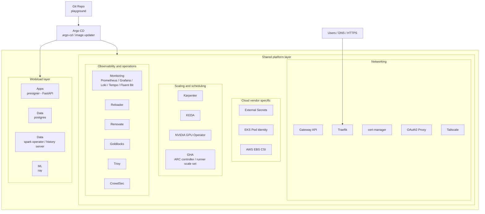

# Playground

Monorepo demonstrating some personal styles + rudimentary capabilities.

- [``apps/``](./cdk-clusters/) - Application code

- [``argo/``](./argo/) - Charts and manifests

- [``data/``](./data/) - Local exploration + simple pipeline layout

- [``infra/``](./infra/) - IaC

## Getting started

### Tooling
- [pipx](https://github.com/pypa/pipx): Tool installer in isolated environments for python tools
- [sdkman](https://sdkman.io/): Tool installer in isolated environments for JVMs / misc SDKs
- [pre-commit](https://pre-commit.com): Git hooks allowing reviewers to avoid style comments + focus on the actual changes
  - [hadolint](https://github.com/hadolint/hadolint): Consistent linting for Dockerfiles; alternatively use `hadolint-binary` in pre-commit hooks
